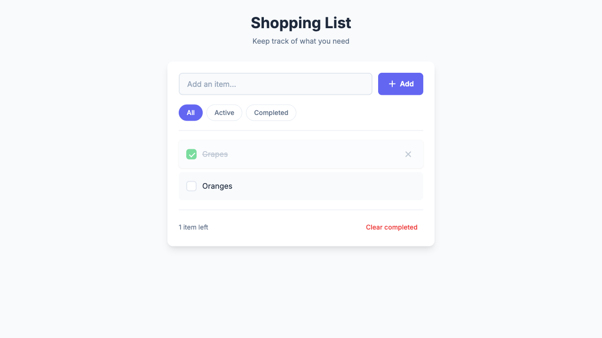

# Shopping List

A simple, elegant shopping list web application to help you keep track of what you need.



## Features

- **Add Items** - Quickly add items to your shopping list
- **Mark Complete** - Check off items as you shop
- **Delete Items** - Remove items you no longer need
- **Filter View** - View All, Active, or Completed items
- **Clear Completed** - Remove all checked items at once
- **Persistent Storage** - Your list is saved locally and persists across sessions
- **Responsive Design** - Works great on desktop and mobile devices

## Getting Started

### Prerequisites

- A modern web browser (Chrome, Firefox, Safari, Edge)
- Python 3.x (for local server) or any static file server

### Running Locally

1. Clone the repository:
   ```bash
   git clone https://github.com/shayke-cohen/shopping-list.git
   cd shopping-list
   ```

2. Start a local server:
   ```bash
   cd src && python3 -m http.server 3000
   ```

3. Open your browser and navigate to:
   ```
   http://localhost:3000
   ```

### Alternative: Using Node.js

```bash
npx serve src -p 3000
```

## Usage

1. **Add an item**: Type in the input field and click "Add" or press Enter
2. **Complete an item**: Click the checkbox next to an item
3. **Delete an item**: Hover over an item and click the X button
4. **Filter items**: Click "All", "Active", or "Completed" buttons
5. **Clear completed**: Click "Clear completed" to remove all checked items

## Tech Stack

- **HTML5** - Semantic markup
- **CSS3** - Modern styling with CSS custom properties
- **Vanilla JavaScript** - No frameworks, pure JS with ES6+ features
- **LocalStorage** - Client-side data persistence
- **Inter Font** - Clean, modern typography from Google Fonts

## Project Structure

```
├── src/
│   ├── index.html      # Main HTML file
│   ├── styles.css      # CSS styles
│   └── app.js          # JavaScript application logic
├── tests/
│   ├── TEST_PLAN.md    # Test plan and results
│   ├── e2e/            # End-to-end test files
│   ├── screenshots/    # Test screenshots
│   └── videos/         # Test recordings
└── README.md           # This file
```

## Testing

The application has been tested with a comprehensive E2E test suite.

### Test Results

| Test Case | Description | Status |
|-----------|-------------|--------|
| TC-001 | Add New Item | PASSED |
| TC-002 | Mark Item as Completed | PASSED |
| TC-003 | Delete Item | PASSED |
| TC-004 | Filter by Active | PASSED |
| TC-005 | Filter by Completed | PASSED |
| TC-006 | Clear Completed | PASSED |
| TC-007 | Data Persistence | PASSED |

**Pass Rate: 100%**

For detailed test information, see [tests/TEST_PLAN.md](tests/TEST_PLAN.md).

### Running Tests

Tests are run using the [AI Tester MCP](https://github.com/testengai/ai-tester) which provides automated E2E testing with Playwright.

**Using Cursor IDE with AI Tester MCP:**
```
Run the test file: tests/e2e/shopping-list.yaml
```

**Using AI Tester CLI:**
```bash
# Install AI Tester CLI
npm install -g @anthropic/ai-tester

# Run tests
ai-tester run tests/e2e/shopping-list.yaml --platform web --url http://localhost:3000
```

**Test file format:** The tests use a YAML-based format compatible with AI Tester:
```yaml
- inputText:
    selector: "#itemInput"
    text: "Apples"
- tapOn:
    selector: ".add-btn"
- assertVisible:
    text: "Apples"
```

## Browser Support

- Chrome (latest)
- Firefox (latest)
- Safari (latest)
- Edge (latest)

## Contributing

1. Fork the repository
2. Create your feature branch (`git checkout -b feature/amazing-feature`)
3. Commit your changes (`git commit -m 'feat: add amazing feature'`)
4. Push to the branch (`git push origin feature/amazing-feature`)
5. Open a Pull Request

## License

This project is open source and available under the [MIT License](LICENSE).

## Acknowledgments

- [Inter Font](https://fonts.google.com/specimen/Inter) by Rasmus Andersson
- Inspired by TodoMVC
