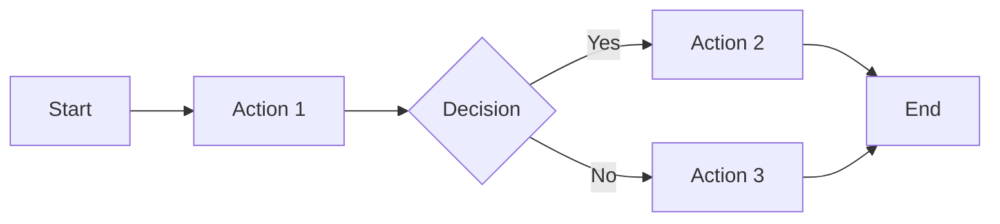

# Feature Specification: [Feature Name]

**Issue:** #NNNN
**Author:** @username
**Status:** Draft | In Review | Approved | Implemented
**Created:** YYYY-MM-DD
**Updated:** YYYY-MM-DD

---

## 1. Overview

### Problem Statement
What problem does this feature solve? Why is it important?

### Goals
- Goal 1
- Goal 2

### Non-Goals
- What this feature will NOT do

---

## 2. User Stories

### Primary User Story
> As a [user type], I want to [action] so that [benefit].

### Additional Stories
- As a..., I want to..., so that...

---

## 3. Requirements

### Functional Requirements

| ID | Requirement | Priority |
|----|-------------|----------|
| FR-1 | Description | Must |
| FR-2 | Description | Should |
| FR-3 | Description | Could |

### Non-Functional Requirements

| ID | Requirement | Metric |
|----|-------------|--------|
| NFR-1 | Performance | < 200ms response |
| NFR-2 | Availability | 99.9% uptime |

---

## 4. User Interface

### Wireframes

[Include wireframe images or links]

```
┌─────────────────────────────────┐
│  Header                         │
├─────────────────────────────────┤
│                                 │
│  [Wireframe sketch]             │
│                                 │
├─────────────────────────────────┤
│  Footer                         │
└─────────────────────────────────┘
```

### User Flow



---

## 5. Acceptance Criteria

- [ ] Criterion 1
- [ ] Criterion 2
- [ ] Criterion 3

---

## 6. Out of Scope / Future Considerations

- Item deferred to future iteration
- Known limitation accepted for now

---

## 7. Open Questions

| Question | Answer | Resolved By |
|----------|--------|-------------|
| Question 1 | TBD | |
| Question 2 | Answer | @username |

---

## 8. Appendix

### References
- [Link to related documentation]
- [Link to similar features]

### Glossary
- **Term**: Definition
